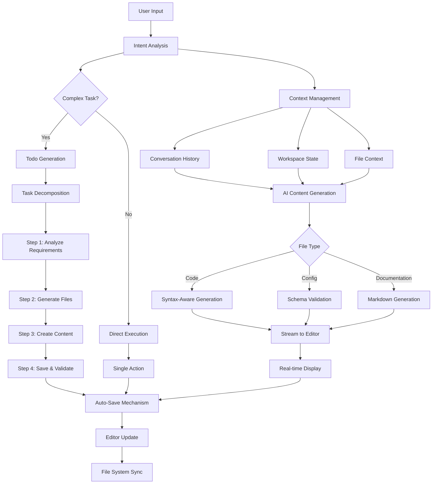

# dLEMMA IDE

A local-first AI development environment designed for secure, offline coding with small language models.

Created by Josh Berns

## Overview

dLEMMA IDE is an experimental development environment that explores the intersection of agentic coding capabilities and data privacy. The project demonstrates how small, locally-run language models can provide sophisticated coding assistance without requiring cloud connectivity or exposing sensitive code to external services.

The core philosophy behind dLEMMA IDE is addressing the developer's dilemma: the need for powerful AI-assisted coding while maintaining complete control over code and data privacy. This system is built specifically to leverage small language models efficiently, proving that effective agentic coding doesn't require massive computational resources.

## Architecture

The IDE implements a multi-layered architecture where each component handles specific aspects of the development workflow:

### System Components

**Electron Main Process**: Manages the application lifecycle, window creation, and system-level operations. Handles file system access and native OS integration.

**IDE Core**: The central orchestrator that manages the editor state, file operations, and coordinates between different subsystems. It maintains the workspace context and handles user interactions.

**AI Manager**: Interfaces with Ollama for local LLM integration. Manages conversation context, streaming responses, and translates user intent into executable actions.

**Todo Manager**: Breaks down complex user requests into actionable steps. Maintains execution state and orchestrates multi-step workflows.

**Terminal Manager**: Provides integrated terminal functionality with proper working directory management. Executes commands in the context of the current workspace.

**Dependency Manager**: Analyzes project structure and manages package dependencies. Provides intelligent suggestions for missing imports and packages.

**Linting Manager**: Integrates with language-specific linters to provide real-time code quality feedback.

## Agentic Flow

The system implements a sophisticated agentic workflow that transforms natural language requests into concrete development actions:

### Key Agentic Capabilities

**Intent Recognition**: The system analyzes user input to determine whether the request requires simple file operations or complex multi-step workflows.

**Dynamic Task Decomposition**: Complex requests are automatically broken down into discrete, executable steps. Each step maintains context from previous operations.

**Context-Aware Generation**: The AI maintains conversation history and workspace context to generate relevant, project-specific code. This ensures generated content aligns with existing project structure and conventions.

**Streaming Integration**: AI responses stream directly into the editor, providing immediate visual feedback while maintaining file system synchronization.

**Auto-Save Pipeline**: A multi-tiered save system ensures no data loss:
- Immediate saves after AI content generation
- Delayed saves for user edits (2-second debounce)
- Memory cache for unsaved files
- File system sync on tab switches

## Technical Implementation

### Local LLM Integration

The system uses Ollama to run language models locally, ensuring complete data privacy. Communication happens through HTTP endpoints with streaming support for real-time content generation.

### File Management

Files are managed through a dual-state system:
- In-memory representation for unsaved changes
- File system persistence for saved content
- Automatic synchronization between states

### Terminal Integration

The integrated terminal maintains proper working directory context, ensuring commands execute in the appropriate project folder. This is critical for build tools, package managers, and version control operations.

### Editor Features

Built on CodeMirror, the editor provides:
- Syntax highlighting for multiple languages
- Real-time linting integration
- AI-powered autocomplete
- Streaming content display
- Multi-file tab management

## Security and Privacy

All processing happens locally on your machine. No code, data, or queries leave your system. The IDE operates completely offline once Ollama and language models are installed.

## Requirements

- Node.js and npm
- Electron framework
- Ollama with compatible language models
- Operating System: macOS, Windows, or Linux

## Installation

1. Clone the repository
2. Install dependencies: `npm install`
3. Download and install Ollama
4. Pull a compatible model: `ollama pull [model-name]`
5. Start the IDE: `npm start`

## Configuration

The IDE automatically detects available Ollama models and allows selection through the UI. No manual configuration is required for basic operation.

## Development Philosophy

This project prioritizes:
- Local-first architecture
- Minimal resource usage
- Complete data sovereignty
- Practical agentic capabilities with small models
- Real-world development workflows

## Experimental Nature

dLEMMA IDE is an experimental project exploring the boundaries of what's possible with small, local language models in development environments. It serves as a proof of concept that sophisticated AI assistance doesn't require cloud infrastructure or large model deployments.

## License

This project is licensed under the Creative Commons Attribution 4.0 International License (CC BY 4.0).

Copyright (c) 2024 Josh Berns

## Author

Josh Berns  
boshjerns@gmail.com

## Acknowledgments

Built with Electron, CodeMirror, and Ollama. Inspired by the need for privacy-preserving development tools in an increasingly connected world.
